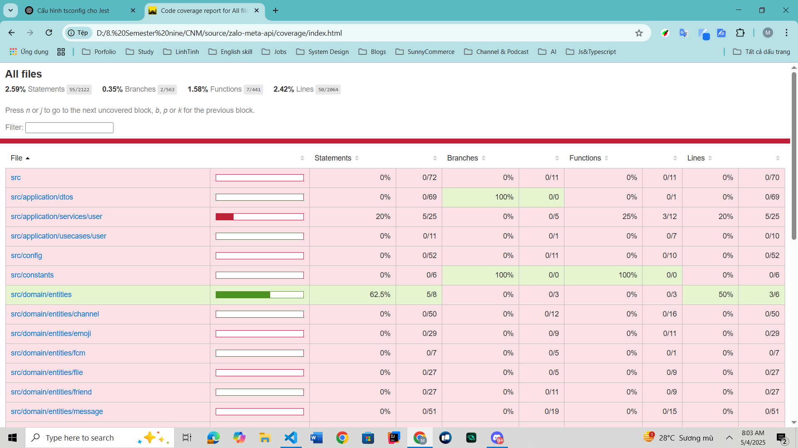

### Từ khóa expect và tobe 

```cmd
        expect(value1).tobe(value2)
=>      Mong muốn value1  bằng với value2
```

# Giải thích Coverage  report view


Khi chạy test với Jest và bật `collectCoverage`, bạn sẽ nhận được một báo cáo với các chỉ số đánh giá mức độ kiểm thử của toàn bộ dự án. Dưới đây là ý nghĩa chi tiết của từng phần trong báo cáo:


| Chỉ số       | Ý nghĩa                                                                 |
|-------------|------------------------------------------------------------------------|
| **Statements** | Số lượng dòng lệnh trong code đã được thực thi trong quá trình test |
| **Branches**   | Số nhánh điều kiện (if/else, switch, ? :) đã được kiểm thử         |
| **Functions**  | Số hàm đã được gọi trong khi chạy test                              |
| **Lines**      | Số dòng code thực tế được chạy trong quá trình test                 |

### Ex: Ví dụ Jest report




- All files
- Statements : 2.59% (55/2122)
- Branches : 0.35% (2/563)
- Functions : 1.58% (7/441)
- Lines : 2.42% (50/2064)


### 📉 Phân tích:

- **Statements**: Chỉ có 55 trên 2122 câu lệnh được kiểm thử → rất thấp
- **Branches**: Chỉ có 2 trên 563 nhánh điều kiện được kiểm thử
- **Functions**: 7/441 hàm được chạy khi test → chưa bao phủ được logic chính
- **Lines**: 50/2064 dòng thực sự được thực thi bởi các test case

>  Kết luận: Code coverage hiện tại rất thấp. Cần bổ sung thêm test để đảm bảo chất lượng và độ tin cậy.


##  Phím tắt trong giao diện report

| Phím | Chức năng                          |
|------|-----------------------------------|
| `n`, `j` | Chuyển đến **block code tiếp theo** chưa được kiểm thử |
| `b`, `p`, `k` | Quay về **block code trước** chưa được kiểm thử |
